# Software Engineering Specification

for

# Multimodal Video Understanding Engine

Version 0.6 Draft

Prepared by Thamer

Date: 2026-05-31

## Revision History

| Name | Date | Reason For Changes | Version |
|---|---|---|---|
| Thamer | 2026-05-28 | Initial requirements draft based on the IEEE template and MVP discussion | 0.1 |
| Thamer | 2026-05-28 | Consolidated requirements, design, architecture, and analysis diagrams into one software engineering specification | 0.2 |
| Thamer | 2026-05-29 | Added provider configuration, scene/window timeline synthesis, timeline retrieval, and evidence-link storage updates | 0.3 |
| Thamer | 2026-05-29 | Added ask-video retrieval, replaceable answer provider, stored-evidence limits, and M6 API/testing details | 0.4 |
| Thamer | 2026-05-29 | Added M7 delivery readiness, manual acceptance checklist, known limitations, local troubleshooting, and runtime artifact controls | 0.5 |
| Thamer | 2026-05-31 | Added M8 product web app foundation, frontend structure, local CORS configuration, browser workflow, frontend checks, and updated release scope | 0.6 |

## Table of Contents

## List of Tables

## List of Figures

## Part I. Introduction and Requirements

This part presents the SRS content for the project. It defines the product scope, external interfaces, system features, nonfunctional requirements, constraints, assumptions, and remaining TBD items that must be understood before implementation starts.

## 1. Introduction

### 1.1 Purpose

This Software Engineering Specification defines the requirements, architecture, software design, data design, testing strategy, and release plan for the first MVP release of the Multimodal Video Understanding Engine. The system allows a user to upload a video, preprocess it into audio transcript segments and key visual frames, build a timestamped timeline, inspect evidence, and ask natural-language questions about the uploaded video.

The scope of this document is the local MVP product. It covers the FastAPI backend, React/Vite local web app, video upload, preprocessing, transcription, frame extraction, scene detection, visual analysis, timeline generation, basic video question answering, local metadata storage, software architecture, module boundaries, API contracts, database design, frontend structure, and testing expectations. It does not cover custom model training, production authentication, real-time video streaming, or large-scale distributed processing.

For M7, this document also covers delivery readiness for the backend MVP: repeatable local setup, environment documentation, manual acceptance testing, known limitations, troubleshooting guidance, and verification commands. M7 does not introduce a React interface, new retrieval architecture, background queue, authentication layer, or production storage system.

For M8, this document also covers the first product web app foundation. M8 introduces a local React/Vite interface over the existing backend APIs for upload, status, analysis, timeline inspection, and question answering. M8 does not introduce authentication, vector search, embeddings, ranking, background queues, or a backend architecture rewrite.

### 1.2 Document Conventions

The requirements portion of this document follows the IEEE requirements template structure, while later sections define the software design and architecture needed for implementation. Requirement identifiers use the following prefixes:

- FR: Functional Requirement
- NFR: Nonfunctional Requirement
- BR: Business Rule
- TBD: To Be Determined item

Priority is marked as High, Medium, or Low. High priority requirements are required for the MVP unless explicitly moved out of scope.

### 1.3 Intended Audience and Reading Suggestions

This document is intended for the product owner, developers, QA testers, operators, and future maintainers. Readers should start with the Product Scope and Overall Description to understand the product vision, then review System Features for functional behavior, Software Architecture and Software Design for implementation structure, and Testing Strategy for verification expectations.

### 1.4 Product Scope

The Multimodal Video Understanding Engine is a local web product and API system that turns uploaded videos into a searchable and question-answerable video memory. Instead of sending every frame to an AI model, the system extracts the important parts of the video: audio transcript with timestamps, keyframes, scene boundaries, visual summaries, and a chronological timeline.

The main objective is to let a user ask questions such as:

- What happened at second 15?
- Summarize the video.
- Did anything unusual happen?
- Identify interface errors shown in the video.

The MVP goal is to prove the software pipeline, not to train a new model.

### 1.5 References

This reference list is treated as a living section. It should be checked during implementation and before release so external tool behavior, API names, and version notes stay current.

| Reference | Purpose | Link |
|---|---|---|
| IEEE SRS Template | Source template provided by the user for the requirements structure. | Local file: srs_template-ieee (3).doc |
| Project MVP Notes | Project discussion and scope notes for the video understanding engine. | Internal project notes |
| FastAPI Documentation | REST API framework, request validation, OpenAPI documentation, and testing support. | [FastAPI](https://fastapi.tiangolo.com/) |
| FFmpeg Documentation | Audio extraction and video processing command behavior. | [FFmpeg](https://ffmpeg.org/documentation.html) |
| OpenCV Documentation | Frame extraction and video decoding reference. | [OpenCV](https://docs.opencv.org/4.x/) |
| PySceneDetect Documentation | Scene boundary detection reference. | [PySceneDetect](https://www.scenedetect.com/docs/latest/) |
| OpenAI Speech to Text Documentation | Transcription API behavior and timestamp planning. | [OpenAI Speech to Text](https://developers.openai.com/api/docs/guides/speech-to-text) |
| OpenAI Images and Vision Documentation | Vision-language analysis behavior for selected frames. | [OpenAI Images and Vision](https://developers.openai.com/api/docs/guides/images-vision) |
| SQLAlchemy Documentation | Database access and repository implementation reference. | [SQLAlchemy](https://docs.sqlalchemy.org/en/20/) |
| Alembic Documentation | Migration planning once schema changes stabilize. | [Alembic](https://alembic.sqlalchemy.org/en/latest/) |

## 2. Overall Description

### 2.1 Product Perspective

The product is a new standalone software system. It acts as an orchestration layer around video processing tools, speech-to-text services, vision-language analysis, and language model reasoning. The first version will expose REST API endpoints and use local file storage plus a lightweight database for metadata.

At a high level, the system flow is:

1. User uploads a video.
2. System stores the video file.
3. System extracts audio from the video.
4. System transcribes the audio with timestamps.
5. System samples keyframes and detects scenes.
6. System analyzes selected visual frames.
7. System builds a chronological timeline.
8. User asks questions about the video.
9. System answers using stored transcript, timeline, frame summaries, and relevant timestamps.

### 2.2 Product Functions

The product must provide the following major functions:

- Upload video files through an API endpoint.
- Validate video type and size.
- Extract audio from uploaded video files.
- Generate transcript text with timestamps.
- Extract keyframes at fixed intervals and, later, by scene changes.
- Detect scene boundaries.
- Analyze selected frames with a vision-language model.
- Generate a structured timeline of events.
- Store video metadata, transcript, keyframes, scene data, and timeline records.
- Answer user questions about a processed video with timestamped evidence.
- Provide a local React/Vite product web app for upload, status, analysis, timeline, and ask workflows.
- Configure the frontend API base URL through local environment variables.
- Show loading, empty, and safe error states in the product web app.

### 2.3 User Classes and Characteristics

| User Class | Description | Main Needs |
|---|---|---|
| Primary User | A product user who uploads a video and asks questions about it. | Simple upload, clear timeline, accurate answers with timestamps. |
| Developer | The engineer implementing and maintaining the backend pipeline. | Modular code, clear API contracts, testable processing steps. |
| QA Tester | A tester verifying product behavior before release. | Repeatable test videos, visible outputs, clear success criteria. |
| Future Admin | A future role that may manage uploaded videos, storage, and system settings. | Access control, cleanup tools, monitoring. Not required for MVP. |

### 2.4 Operating Environment

The MVP will run in a local development environment with:

- macOS or Linux development machine.
- Python 3.11 or newer.
- Node.js 20 or newer for the local web app.
- FastAPI backend.
- Uvicorn development server.
- React and Vite development server for the local product web app.
- FFmpeg installed on the host machine.
- OpenCV for frame extraction.
- PySceneDetect for scene detection.
- Provider API access for transcription and vision-language reasoning, initially OpenAI or Gemini.
- SQLite for initial metadata storage, with PostgreSQL as a future upgrade.
- Local folders for uploaded videos, extracted audio, and keyframes.

### 2.5 Design and Implementation Constraints

- The MVP must not require training a custom AI model.
- The first release must prioritize a working pipeline over dashboard, login, or microservices.
- Video processing depends on FFmpeg being installed.
- Transcription and vision analysis depend on external model APIs and valid API credentials.
- Uploaded files must be stored safely and must not overwrite unrelated files.
- Processing large videos may be slow or expensive, so the MVP should target short videos first.
- The system must preserve timestamps across transcript, frames, scenes, timeline events, and answers.

### 2.6 User Documentation

The MVP should include:

- README with setup instructions.
- Environment variable guide, including API key configuration.
- API endpoint documentation through FastAPI Swagger UI.
- Sample workflow for uploading and analyzing a short video.
- Frontend setup and environment instructions.
- Testing instructions.
- Manual acceptance checklist covering upload, analyze, timeline, and ask through the product web app.
- Known limitations for the local MVP release.
- Local troubleshooting notes for port conflicts, FFmpeg, provider keys, SQLite/local data, and frontend API base URL configuration.

### 2.7 Assumptions and Dependencies

- Users will initially upload short videos suitable for local development testing.
- Supported formats for the MVP are mp4 and mov. Other formats are TBD.
- The user has permission to process the uploaded video.
- The development machine has enough disk space for uploads, audio files, and extracted frames.
- External provider APIs are available during analysis.
- The first release does not require real-time processing or live camera input.

## 3. External Interface Requirements

### 3.1 User Interfaces

The M8 MVP user interface is a local React/Vite web app. FastAPI Swagger UI remains available as API documentation and a developer-facing fallback, but the product owner workflow should use the web app.

The product web app includes:

- Video upload view.
- Analysis status view.
- Timeline view with timestamped events.
- Video question-answering view.
- Evidence view showing relevant timestamps and frame references.
- Loading, empty, and safe error states for backend offline, unsupported files, not-analyzed videos, failed analysis, and provider configuration failures.

### 3.2 Hardware Interfaces

No special hardware interface is required for the MVP. The system should run on a standard development laptop. GPU acceleration is not required for the first release because model inference will be handled through external APIs.

### 3.3 Software Interfaces

| Component | Purpose |
|---|---|
| FastAPI | REST API backend framework. |
| React | Local product web app UI framework. |
| Vite | Frontend development server and build tool. |
| FFmpeg | Extract audio from video and support video processing operations. |
| OpenCV | Read videos and extract frames. |
| PySceneDetect | Detect scene boundaries. |
| Provider transcription API | Convert extracted audio into transcript text with timestamps. |
| Provider vision-language model | Analyze selected keyframes and visual context. |
| SQLite | Store metadata and analysis records for the MVP. |
| SQLAlchemy | Provide database access through repository classes. |
| Alembic | Manage database migrations once the schema stabilizes for release. |

### 3.4 Communications Interfaces

The system will expose HTTP REST endpoints. File upload must use multipart/form-data. Structured responses must use JSON. The local React/Vite app will call the backend through a configurable API base URL and a limited CORS allowlist for local origins. Future deployment should use HTTPS to protect uploaded media, transcripts, and analysis results.

## 4. System Features

### 4.1 Video Upload

#### 4.1.1 Description and Priority

Priority: High.

The system shall allow the user to upload a video file for processing.

#### 4.1.2 Stimulus/Response Sequences

1. User sends a video file to the upload endpoint.
2. System validates the file type and stores the file.
3. System creates a video record with a unique identifier.
4. System returns the video identifier and initial status.

#### 4.1.3 Functional Requirements

- FR-1: The system shall provide an endpoint to upload a video file.
- FR-2: The system shall accept mp4 and mov files for the MVP.
- FR-3: The system shall reject unsupported file types with a clear error response.
- FR-4: The system shall store uploaded videos in a dedicated uploads directory.
- FR-5: The system shall generate a unique video identifier for each upload.
- FR-6: The system shall prevent uploaded files from overwriting existing files.

### 4.2 Video Preprocessing

#### 4.2.1 Description and Priority

Priority: High.

The system shall preprocess uploaded videos by extracting audio, transcript segments, keyframes, and scene boundaries.

#### 4.2.2 Stimulus/Response Sequences

1. User requests analysis for an uploaded video.
2. System extracts audio from the video.
3. System transcribes the audio.
4. System extracts keyframes at configured intervals.
5. System detects scene boundaries.
6. System stores preprocessing outputs.

#### 4.2.3 Functional Requirements

- FR-7: The system shall extract audio from an uploaded video using FFmpeg.
- FR-8: The system shall store extracted audio in a dedicated audio directory.
- FR-9: The system shall transcribe extracted audio using a transcription service.
- FR-10: The system shall preserve transcript timestamps when available.
- FR-11: The system shall extract keyframes at a configurable interval.
- FR-12: The system shall store keyframes with their source video identifier and timestamp.
- FR-13: The system shall detect scene changes when scene detection is enabled.
- FR-14: The system shall store scene start and end timestamps.
- FR-15: The system shall mark analysis status as failed if a preprocessing step fails.

### 4.3 Visual Analysis and Timeline Generation

#### 4.3.1 Description and Priority

Priority: High.

The system shall analyze selected keyframes and combine visual information with transcript segments inside scene or time-window boundaries. Timeline generation must remain evidence-first: the system builds events from stored transcript segments, keyframes, scene records, and visual summaries rather than treating the whole video as an opaque model prompt.

#### 4.3.2 Stimulus/Response Sequences

1. System creates visual summaries for selected keyframes.
2. System groups transcript segments, visual summaries, and keyframes by scene or fallback time window.
3. System synthesizes one timeline event per scene or window.
4. System stores each timeline event with evidence links to transcript, frame, and scene records.
5. User requests the timeline.
6. System returns ordered events with timestamps and evidence references.

#### 4.3.3 Functional Requirements

- FR-16: The system shall create a visual summary for selected keyframes.
- FR-17: The system shall connect visual summaries to timestamps.
- FR-18: The system shall combine transcript segments and visual summaries into timeline events.
- FR-19: The system shall return timeline events sorted by start time.
- FR-20: Each timeline event shall include start time, end time when available, summary, and evidence references.
- FR-21: The system shall avoid sending every video frame to the model by default.

### 4.4 Video Question Answering

#### 4.4.1 Description and Priority

Priority: High.

The system shall allow the user to ask natural-language questions about a processed video.
For M6, question answering is limited to retrieval plus answer generation over stored
evidence. Ranking, embeddings, vector search, deep mode, full-video prompting, and
new timeline generation are deferred so the API can remain stable while retrieval
quality improves later.

#### 4.4.2 Stimulus/Response Sequences

1. User submits a question for a specific video.
2. System retrieves ordered timeline events and bounded transcript, frame, and scene context.
3. System generates an answer using the retrieved evidence.
4. System returns the answer with timestamped evidence.

#### 4.4.3 Functional Requirements

- FR-22: The system shall provide an endpoint for asking questions about a video.
- FR-23: The system shall reject questions for videos that have not been analyzed.
- FR-24: The system shall retrieve stored timeline, transcript, and frame context before answering.
- FR-25: The system shall include timestamped evidence in the answer when possible.
- FR-26: The system shall support questions about a specific timestamp.
- FR-27: The system shall support summary questions about the full video.
- FR-28: The system shall return a clear response when the evidence is insufficient.
- FR-28a: The ask endpoint shall not rerun video analysis or generate a new timeline.

### 4.5 Storage and Retrieval

#### 4.5.1 Description and Priority

Priority: Medium.

The system shall store metadata and analysis results so the same video does not need to be fully reprocessed for every user question.

#### 4.5.2 Stimulus/Response Sequences

1. System completes an analysis step.
2. System writes resulting metadata to storage.
3. User requests timeline or asks a question.
4. System reads existing records instead of repeating the full pipeline.

#### 4.5.3 Functional Requirements

- FR-29: The system shall store video metadata, including filename, storage path, upload time, and analysis status.
- FR-30: The system shall store transcript segments.
- FR-31: The system shall store keyframe metadata.
- FR-32: The system shall store scene metadata.
- FR-33: The system shall store timeline events.
- FR-34: The system shall support retrieving a video timeline by video identifier.
- FR-35: The system shall support retrieving video processing status by video identifier.

### 4.6 Product Web App Foundation

#### 4.6.1 Description and Priority

Priority: High.

The system shall provide a local product web app so a product owner, developer, or QA tester can complete the main workflow without using raw API calls.

#### 4.6.2 Stimulus/Response Sequences

1. User opens the local web app.
2. User uploads an mp4 or mov video.
3. System displays upload metadata and current status.
4. User starts analysis from the web app.
5. System displays loading state and later shows analyzed status and analysis counts.
6. User views timeline events with timestamped evidence.
7. User asks a question.
8. System displays an answer and supporting evidence timestamps.

#### 4.6.3 Functional Requirements

- FR-36: The system shall provide a React/Vite local web app as the first product user interface.
- FR-37: The web app shall allow users to upload supported video files.
- FR-38: The web app shall display video status and analysis counts returned by the backend.
- FR-39: The web app shall allow users to start analysis for an uploaded or loaded video.
- FR-40: The web app shall display timeline events with timestamps and evidence references.
- FR-41: The web app shall allow users to ask questions about analyzed videos.
- FR-42: The web app shall display answers with timestamped evidence returned by the backend.
- FR-43: The web app shall read the backend API base URL from frontend environment configuration.
- FR-44: The web app shall show clear loading, empty, and error states.
- FR-45: The web app shall support loading an existing video record by video identifier for local verification.

## 5. Other Nonfunctional Requirements

### 5.1 Performance Requirements

- NFR-1: The system should avoid analyzing every frame of a video unless explicitly configured to do so.
- NFR-2: The system should support configurable frame sampling intervals.
- NFR-3: For MVP testing, the system should target short videos up to 2 minutes. Larger limits are TBD.
- NFR-4: The system should reuse stored analysis results for repeated questions.
- NFR-5: Long-running analysis should be designed so it can later move to a background queue.

### 5.2 Safety Requirements

- NFR-6: The system shall validate uploaded file extensions and content type before processing.
- NFR-7: The system shall isolate uploaded media files in project-controlled directories.
- NFR-8: The system shall handle corrupted or unreadable video files without crashing the API process.
- NFR-9: The system shall not execute uploaded files as programs or scripts.

### 5.3 Security Requirements

- NFR-10: API keys shall be loaded from environment variables and shall not be committed to source control.
- NFR-11: Uploaded videos and extracted assets shall not be publicly exposed in the MVP unless explicitly served through controlled endpoints.
- NFR-12: The system shall avoid logging sensitive API keys or full external service credentials.
- NFR-13: A maximum upload size shall be defined before deployment. The local MVP default is 250 MB.
- NFR-14: Production deployment shall use HTTPS.

### 5.4 Software Quality Attributes

- NFR-15: The backend shall be organized into separate modules for upload handling, video processing, transcription, frame extraction, timeline building, and question answering.
- NFR-16: Core processing functions shall be testable without requiring the FastAPI server to run.
- NFR-17: The system shall produce traceable outputs so answers can be linked back to timestamps and evidence.
- NFR-18: The API shall return clear error messages for invalid video IDs, unsupported files, failed analysis, and missing configuration.
- NFR-19: The codebase shall support replacing SQLite with PostgreSQL in a future release.
- NFR-20: The frontend shall use a clean structure for API client code, components, views, hooks/state, utilities, and styles.
- NFR-21: The frontend shall map backend errors to safe user-facing messages without exposing secrets, stack traces, or private local paths.
- NFR-22: Local frontend origins shall be configurable through backend environment settings.

### 5.5 Business Rules

- BR-1: The MVP shall focus on a working pipeline and shall not include custom model training.
- BR-2: A user cannot ask questions about a video until analysis has completed successfully.
- BR-3: Answers should cite timestamps or frame references whenever evidence exists.
- BR-4: The system should not reprocess a video from scratch for every question.
- BR-5: Authentication and user accounts are out of scope for the first MVP unless required by product delivery criteria.

## 6. Other Requirements

- OR-1: The project shall include a README with installation and usage instructions.
- OR-2: The project shall include a .env.example file documenting required environment variables.
- OR-3: The project shall include a simple test strategy before implementation is considered complete.
- OR-4: The project should be prepared for GitHub release with a clear repository structure.
- OR-5: Docker support is optional for the first release and may be added after the local MVP works.
- OR-6: The project shall include a manual acceptance checklist for the local MVP product workflow.
- OR-7: The project shall document known limitations and local troubleshooting before delivery.
- OR-8: Local secrets, SQLite databases, uploaded media, extracted audio, and extracted frames shall remain out of source control.
- OR-9: The project shall include frontend check, test, and build commands for the M8 web app.
- OR-10: The project shall document local frontend setup and API base URL configuration.

## Part II. Software Architecture

This part defines the high-level architecture before the detailed design. In standard software engineering practice, architecture comes before detailed module design because it decides the system style, boundaries, deployment assumptions, data ownership, integration direction, and major technical constraints. The later design section then translates these decisions into files, classes, APIs, schemas, and tests.

## 7. Software Architecture

This section defines the architectural foundation for the MVP. The purpose is to make implementation easier, safer, and more professional by clarifying module boundaries, data ownership, processing flow, status handling, and future extension points before coding begins.

### 7.1 Architecture Goals

- Build a local-first MVP that proves the video understanding pipeline.
- Use a modular monolith to keep development simple while preserving clean internal boundaries.
- Make transcription, frame analysis, storage, and question answering replaceable.
- Preserve timestamp traceability from raw video to final answer.
- Keep the design ready for background workers without requiring them in the first MVP.
- Avoid custom model training in the MVP and rely on proven external AI services.

### 7.2 Architectural Style: Modular Monolith

The backend will run as one FastAPI application. Internally, the application will be divided into modules by responsibility. The M8 product web app will run as a separate local React/Vite frontend that consumes the existing backend API. This avoids the complexity of early microservices while still preventing the codebase from becoming one large script.

Architectural rules:

- API routes shall not call FFmpeg, OpenCV, PySceneDetect, or provider APIs directly.
- Application services shall orchestrate workflows.
- Infrastructure adapters shall isolate external tools and APIs.
- Repositories shall isolate database access.
- Domain objects shall represent video memory concepts such as videos, transcript segments, keyframes, scenes, timeline events, and evidence links.
- The frontend shall remain a product interface layer and shall not duplicate backend processing, retrieval, or storage logic.

### 7.3 Layered Module Boundaries

| Layer | Responsibility | Examples |
|---|---|---|
| API Layer | HTTP endpoints, request validation, response schemas, HTTP errors | `app/api/videos.py`, `app/schemas.py` |
| Application Layer | Main workflows and business orchestration | `video_storage.py`, `video_processor.py`, `timeline_builder.py`, `question_answerer.py` |
| Domain Layer | Core entities and status concepts | `Video`, `TranscriptSegment`, `Keyframe`, `Scene`, `TimelineEvent`, `EvidenceLink` |
| Persistence Layer | Database models and repositories | `video_repository.py`, SQLite models |
| Infrastructure Layer | External tools, file storage, and provider API clients | FFmpeg, OpenCV, PySceneDetect, OpenAI clients, Gemini clients |
| Frontend Layer | Local product web app, API client, UI state, and visual presentation | `frontend/src/api`, `frontend/src/components`, `frontend/src/hooks`, `frontend/src/views`, `frontend/src/styles` |

### 7.4 API Boundaries

The MVP API should remain small and explicit:

| Endpoint | Purpose |
|---|---|
| `POST /videos/upload` | Upload a video and create a video record. |
| `POST /videos/{video_id}/analyze` | Run the analysis pipeline for an uploaded video. |
| `GET /videos/{video_id}/status` | Return the current processing status and failure reason when available. |
| `GET /videos/{video_id}/timeline` | Return stored timeline events. |
| `POST /videos/{video_id}/ask` | Answer a question using stored video memory. |

The API should return clear error responses for invalid input, unsupported files, missing video records, ask-before-analysis conflicts, failed processing, and missing configuration.

The M8 frontend should consume these endpoints without requiring new product API endpoints. Local browser access is enabled by a configurable CORS allowlist, not by weakening API contracts or serving runtime media folders publicly.

### 7.5 Pipeline Orchestration

The `VideoProcessor` service coordinates the pipeline but does not implement every processing detail directly. Each step should be its own service with a structured input and output.

Pipeline steps:

1. Validate and store the uploaded video.
2. Extract audio from the video.
3. Transcribe audio and preserve timestamps when available.
4. Extract keyframes at a configurable interval.
5. Detect scene boundaries.
6. Analyze selected frames.
7. Build scene/window timeline events from transcript, scenes, keyframes, and visual summaries.
8. Store analysis results for reuse.
9. Answer questions using stored evidence.

The system shall not reprocess a full video for every user question. The timeline layer stores compact, traceable context so later question answering can retrieve evidence instead of re-running full-clip analysis.

### 7.6 Data and Storage Architecture

Large media files should be stored as local files in the MVP. Metadata and analysis outputs should be stored in SQLite.

Storage rules:

- Store uploaded videos under `data/uploads`.
- Store extracted audio under `data/audio`.
- Store keyframes under `data/frames/{video_id}`.
- Store paths, timestamps, summaries, status values, and evidence links in the database.
- Keep database schema compatible with future PostgreSQL migration.
- Add indexes for `video_id`, `(video_id, start_time)`, and timeline lookup fields during implementation.

### 7.7 Async Readiness

The MVP may execute analysis synchronously, but the architecture should treat analysis as a job-like workflow. This makes it easier to move analysis to Redis and Celery later.

Async-ready rules:

- Store video status explicitly.
- Expose status through an API endpoint.
- Keep pipeline steps idempotent where practical.
- Make retry from `failed` to `processing` explicit.
- Avoid keeping processing state only in memory.

### 7.8 Error and Status Handling

Valid video states:

- `uploaded`
- `processing`
- `analyzed`
- `failed`

The system should use controlled exceptions for validation errors, not found errors, conflict errors, processing errors, and configuration errors. It must not expose stack traces, API keys, or internal secrets through API responses. When processing fails, the failure reason should be saved safely on the video record.

### 7.9 Testability

The architecture must support testing without requiring real external provider calls for every test.

Testing rules:

- Use fake transcription and vision clients in unit and integration tests.
- Use fake answer providers for question-answering tests.
- Unit test each processing service without starting FastAPI.
- Integration test endpoints with mocked provider calls.
- Use temporary directories and a temporary SQLite database.
- Test unsupported file type, missing video ID, corrupted video, ask-before-analysis, empty ask questions, insufficient ask evidence, successful timeline retrieval, and successful question answering.

### 7.10 Architecture Decisions

| Decision | Rationale | Consequence |
|---|---|---|
| Modular monolith | Fast MVP with clean internal boundaries | Easier development now, still extensible later |
| SQLite first | Simple local product setup | PostgreSQL migration can be added later |
| SQLAlchemy repository access | Keeps database code isolated and migration-friendly | Slight setup overhead, better maintainability |
| Alembic before release | Makes schema changes traceable | Can be introduced after the first tables are stable |
| Local files for media | Avoid storing large blobs in the database | Requires cleanup policy later |
| External provider APIs | Avoid custom model training in MVP | Requires API key, cost control, and mocking in tests |
| Timestamped evidence | Makes answers trustworthy and verifiable | Requires careful timestamp and evidence modeling |
| Retrieval-first question answering | Keeps M6 scoped to stored evidence without ranking, embeddings, vector search, or full-video prompting | Enables later retrieval improvements without changing the ask API |
| Replaceable answer provider | Keeps answer generation behind a small interface | Tests can use fakes and future providers can be added without changing route logic |
| Explicit status model | Supports retries and future background workers | Requires status endpoint and consistent transitions |
| React/Vite local web app | Provides the first usable product surface without changing backend architecture | Requires Node.js tooling and frontend verification commands |
| Configurable local CORS allowlist | Allows the local web app to call the API directly | Requires documented frontend origins and environment configuration |

## Part III. Software Design

This part turns the architecture into implementable design decisions. It explains the repository structure, API layer, application services, infrastructure adapters, domain model, database schema, integration contracts, and data movement rules that the coding phase should follow.

## 8. Software Design

This section translates the requirements and architecture into practical implementation boundaries. The goal is to make the first coding phase predictable: each module should have a clear reason to exist, a narrow responsibility, and a testable contract.

### 8.1 Proposed Project Structure

The repository should be organized by responsibility instead of by technical accident. The structure below keeps API code, workflow orchestration, domain concepts, external adapters, persistence, tests, and documentation separated while still remaining simple enough for an MVP.

| Area | Location | Design Responsibility |
|---|---|---|
| Application entry point | app/main.py | Creates the FastAPI application, registers routers, and exposes the local development server entry point. |
| Configuration | app/config.py | Loads environment variables, paths, upload limits, model settings, and feature flags from one controlled place. |
| Database setup | app/database.py | Creates the database engine, sessions, and initialization helpers used by repositories. |
| API package | app/api/videos.py | Defines upload, analyze, status, timeline, and ask endpoints without owning processing logic. |
| Schema package | app/schemas.py | Defines Pydantic request and response models so API contracts stay explicit. |
| Domain package | app/domain | Defines entities, statuses, and controlled errors that represent the video memory model. |
| Service package | app/services | Coordinates upload storage, analysis, timeline generation, and question answering workflows. |
| Adapter package | app/adapters | Wraps FFmpeg, OpenCV, PySceneDetect, transcription APIs, and vision-language APIs. |
| Repository package | app/repositories | Persists and retrieves videos, transcript segments, keyframes, scenes, timeline events, and evidence links. |
| Database models | app/db/models.py | Defines ORM models that map the domain data to SQLite tables. |
| Runtime data | data/uploads, data/audio, data/frames | Stores large local media artifacts outside the database. |
| SQLite database | data/video_ai.sqlite3 | Stores metadata and analysis records for the MVP. |
| Frontend app | frontend | Contains the React/Vite product web app, API client, components, hooks, views, tests, and styles. |
| Automated tests | tests | Verifies upload behavior, frame extraction, timeline building, API contracts, and error cases. |
| Project documentation | docs | Stores this software engineering specification and supporting diagrams. |
| Setup files | requirements.txt, .env.example, README.md, frontend/package.json | Defines dependencies, environment variables, and user setup workflow. |

**Application entry point.** The main file should stay thin. It should create the app, include routers, and configure startup behavior only.

**API package.** Route handlers should validate HTTP requests and map application errors to HTTP responses. They should not run FFmpeg commands, call provider APIs, or write database records directly.

**Domain package.** Domain files define the shared vocabulary of the system: video statuses, entity fields, evidence types, and safe application errors.

**Service package.** Services own the workflow. For example, the video processor coordinates audio extraction, transcription, keyframe sampling, scene detection, frame analysis, timeline building, status changes, and persistence.

**Adapter package.** Adapters protect the core system from tool-specific details. If FFmpeg, OpenCV, PySceneDetect, or the AI provider changes later, the change should mostly stay inside this layer.

**Repository package.** Repositories keep SQLAlchemy and SQL details away from API handlers and services. This makes tests easier and keeps the future PostgreSQL migration cleaner.

**Runtime data folders.** The MVP stores large files on disk and stores only metadata in SQLite. This avoids putting video blobs inside the database and keeps local development simple.

**Automated tests.** Tests should use temporary folders, a temporary SQLite database, and fake provider clients so most verification can run without external API cost.

### 8.2 API Layer Design

Primary file: `app/api/videos.py`.

Responsibilities:

- Define the video upload, analysis, status, timeline, and question-answering endpoints.
- Validate HTTP requests and return structured JSON responses.
- Convert application errors into appropriate HTTP status codes.
- Use Pydantic request and response schemas.
- Avoid direct calls to FFmpeg, OpenCV, PySceneDetect, provider APIs, or database internals.

### 8.3 Frontend Layer Design

Primary location: `frontend/src`.

Responsibilities:

- Provide the local product interface for upload, status, analysis, timeline, and ask workflows.
- Keep backend communication inside a typed frontend API client.
- Keep reusable UI in components and workflow state in hooks.
- Configure the backend API base URL through `VITE_API_BASE_URL`.
- Display clear loading, empty, and safe error states.
- Avoid adding authentication, ranking, embeddings, vector search, background queue behavior, or backend processing logic.

Frontend structure:

| Area | Responsibility |
|---|---|
| `frontend/src/api` | API client, response types, and user-facing error mapping. |
| `frontend/src/components` | Reusable product UI components for upload, status, timeline, evidence, errors, and ask. |
| `frontend/src/hooks` | Local workflow state for selected video, upload, status, analysis, timeline, and answer. |
| `frontend/src/views` | Composed product workspace view. |
| `frontend/src/styles` | Base styling and product layout. |
| `frontend/src/utils` | Small formatting helpers such as time and file labels. |
| `frontend/src/test` | Frontend test setup. |

### 8.4 Application Service Design

Application services coordinate the system workflows. They are allowed to call repositories and infrastructure adapters, but they should not contain low-level processing details.

| Service | Primary Responsibility |
|---|---|
| `video_storage.py` | Validate file metadata, generate safe names, store uploaded videos, and create video records. |
| `video_processor.py` | Orchestrate the full analysis workflow and status transitions. |
| `timeline_builder.py` | Group transcript segments, scenes, keyframes, and visual summaries into ordered scene/window timeline events with evidence links. |
| `question_answerer.py` | Retrieve bounded stored evidence and generate answers through a replaceable answer provider with timestamp references. |

### 8.5 Infrastructure Adapter Design

Infrastructure adapters isolate external tools and APIs behind small local interfaces. This keeps the core application testable and makes later replacement easier.

| Adapter | Tool or API | Output |
|---|---|---|
| `adapters/audio_extractor.py` | FFmpeg | Audio file path and extraction metadata. |
| `adapters/transcriber.py` | Provider transcription service | Transcript segments with timestamps when available. |
| `adapters/frame_extractor.py` | OpenCV | Keyframe records with timestamps and file paths. |
| `adapters/scene_detector.py` | PySceneDetect | Scene start and end timestamps. |
| `adapters/frame_analyzer.py` | Provider vision-language model | Visual summaries linked to frames and timestamps. |
| `adapters/provider_factory.py` | Provider configuration | Selects active transcription and frame-analysis adapters. |

### 8.6 Repository Design

Primary file: `app/repositories/video_repository.py`.

Responsibilities:

- Create and update video records.
- Persist transcript segments, keyframes, scenes, timeline events, and evidence links.
- Retrieve timeline data by video identifier.
- Retrieve ordered stored evidence for question answering.
- Retrieve video status and failure reason.
- Keep database operations away from API route handlers and processing services.

### 8.7 Domain Model Design

The domain model should represent the video memory created by the pipeline:

- `Video`: upload metadata, storage path, status, timestamps, and safe failure reason.
- `TranscriptSegment`: timestamped audio text.
- `Keyframe`: selected frame path, timestamp, and optional visual summary.
- `Scene`: detected start and end timestamps with optional summary.
- `TimelineEvent`: ordered description of what happened during a time interval.
- `EvidenceLink`: link from an answer or timeline event back to transcript, frame, scene, or timeline evidence.

### 8.8 Error Handling Design

The implementation should use controlled application exceptions instead of leaking raw tool or API failures into route handlers.

| Error Type | Example | API Response |
|---|---|---|
| Validation error | Unsupported file extension | 400 |
| Not found | Unknown video ID | 404 |
| Conflict | Ask before analysis completes | 409 |
| Processing error | FFmpeg fails or video is corrupted | 500 with safe message |
| Configuration error | Missing API key | 500 with safe message |

Internal logs may contain diagnostic details, but API responses must not expose API keys, local secrets, full stack traces, or sensitive file paths.

### 8.9 Configuration Design

Configuration should be loaded from environment variables through one central settings module.

| Variable | Purpose | Default |
|---|---|---|
| `APP_NAME` | FastAPI application name shown in health and OpenAPI metadata. | `Multimodal Video Understanding Engine` |
| `APP_VERSION` | Application version shown in health and OpenAPI metadata. | `0.1.0` |
| `ENVIRONMENT` | Local environment label returned by the health endpoint. | `development` |
| `MODEL_PROVIDER` | Default provider used by model-backed adapters. | `openai` |
| `TRANSCRIPTION_PROVIDER_ORDER` | Optional comma-separated transcription fallback order. | Empty |
| `FRAME_ANALYSIS_PROVIDER` | Optional provider override for frame summaries. | Empty |
| `OPENAI_API_KEY` | OpenAI API key for transcription or vision-language analysis when OpenAI is selected. | Required when used |
| `GEMINI_API_KEY` | Gemini API key for transcription or frame analysis when Gemini is selected. | Required when used |
| `TRANSCRIPTION_MODEL` | OpenAI transcription model. | `whisper-1` |
| `VISION_MODEL` | OpenAI vision-language model. | `gpt-4.1-mini` |
| `GEMINI_MODEL` | Gemini model used by Gemini adapters. | `gemini-3.5-flash` |
| `DATABASE_URL` | SQLite database path or future PostgreSQL URL. | `sqlite:///data/video_ai.sqlite3` |
| `UPLOAD_DIR` | Uploaded video directory. | `data/uploads` |
| `AUDIO_DIR` | Extracted audio directory. | `data/audio` |
| `FRAME_DIR` | Extracted frame directory. | `data/frames` |
| `FRAME_SAMPLE_SECONDS` | Frame sampling interval. | `2` |
| `MAX_UPLOAD_MB` | Maximum upload size for local MVP uploads. | `250` |
| `ALLOWED_VIDEO_EXTENSIONS` | Comma-separated list of accepted video extensions. | `mp4,mov` |
| `CORS_ALLOWED_ORIGINS` | Comma-separated local frontend origins allowed to call the API. | `http://127.0.0.1:5173,http://localhost:5173` |
| `VITE_API_BASE_URL` | Frontend API base URL used by the React/Vite app. | `http://127.0.0.1:8000` |

The backend `.env.example` file shall list every backend runtime setting without real secrets.
The frontend `.env.example` file shall list frontend-only public local settings.
Local `.env` and `frontend/.env.local` files are developer-specific and must not be committed.

## 9. Data Design

The MVP uses local files for large media assets and SQLite for metadata. This split keeps the database small, makes local development simple, and keeps the schema migration-friendly for PostgreSQL later.

### 9.1 File Storage Design

| Asset | Storage Location | Notes |
|---|---|---|
| Uploaded videos | `data/uploads/{video_id}/original.ext` | Preserve original extension, avoid unsafe filenames. |
| Extracted audio | `data/audio/{video_id}/audio.wav` | Generated by FFmpeg. |
| Keyframes | `data/frames/{video_id}/frame_000001.jpg` | Store frame timestamp in the database. |
| SQLite database | `data/video_ai.sqlite3` | Metadata and analysis records only. |

### 9.2 Database Entities

| Entity | Purpose |
|---|---|
| `videos` | Stores video metadata, status, paths, and failure reason. |
| `transcript_segments` | Stores timestamped audio transcript segments. |
| `keyframes` | Stores selected frame metadata and visual summaries. |
| `scenes` | Stores scene boundaries and optional scene summaries. |
| `timeline_events` | Stores chronological events built from multimodal evidence. |
| `evidence_links` | Stores references from timeline events or answers to supporting evidence. |

### 9.3 Indexing Strategy

Indexes should be driven by the way the API reads video memory. The MVP will repeatedly look up one video, retrieve ordered time-based evidence, and load timeline relationships.

| Read Pattern | Recommended Index | Why It Matters |
|---|---|---|
| Load one video by ID | `videos.id` | Supports upload, status, analyze, timeline, and ask endpoints. |
| Load all transcript for one video | `transcript_segments.video_id` | Speeds transcript retrieval for summaries and timeline building. |
| Find transcript near a timestamp | `transcript_segments(video_id, start_time)` | Supports questions such as what happened at second 15. |
| Find frames near a timestamp | `keyframes(video_id, time)` | Supports timestamp evidence and targeted visual context. |
| Load scenes in order | `scenes(video_id, start_time)` | Supports scene-based timeline generation. |
| Load timeline in order | `timeline_events(video_id, start_time)` | Supports the timeline endpoint and evidence retrieval. |
| Load evidence for one event | `evidence_links.timeline_event_id` | Supports answer explanations and traceability. |

**Index rule.** The implementation should add indexes only after the table fields are stable enough to avoid migration churn. For the first local prototype, primary keys and the timeline lookup indexes are the highest priority.

### 9.4 Status Model

| Status | Meaning | Allowed Next Status |
|---|---|---|
| `uploaded` | Video file was stored but not analyzed. | `processing` |
| `processing` | Analysis pipeline is currently running. | `analyzed`, `failed` |
| `analyzed` | Analysis completed successfully. | `processing` for explicit reanalysis, future `archived` |
| `failed` | Analysis failed and safe error details are available. | `processing` for retry |

### 9.5 Implementation Schema Summary

The exact migration file will be created during implementation, but the MVP schema should follow this table-level contract. The table below keeps each entity compact and moves longer rules into the notes after the table.

| Table | Primary Role | Required Fields |
|---|---|---|
| `videos` | Owns upload metadata and analysis status. | `id`, `original_filename`, `stored_path`, `status`, `created_at`, `updated_at`, `error_message` |
| `transcript_segments` | Stores speech-to-text output with time boundaries. | `id`, `video_id`, `start_time`, `end_time`, `text` |
| `keyframes` | Stores selected visual evidence from the video. | `id`, `video_id`, `time`, `path`, `visual_summary` |
| `scenes` | Stores detected scene boundaries and optional summaries. | `id`, `video_id`, `start_time`, `end_time`, `summary` |
| `timeline_events` | Stores chronological multimodal events. | `id`, `video_id`, `start_time`, `end_time`, `summary` |
| `evidence_links` | Connects timeline events to transcript, frame, scene, or timeline evidence. | `id`, `timeline_event_id`, `evidence_type`, `evidence_id` |

**Primary keys.** Each table should use a backend-generated string identifier. UUID strings are acceptable for the MVP.

**Foreign keys.** Transcript segments, keyframes, scenes, and timeline events must reference `videos.id`. Evidence links must reference `timeline_events.id`.

**Status constraint.** The `videos.status` value must stay inside the lifecycle defined in Section 9.4.

**Time constraints.** When both start and end time exist, `start_time` must be less than or equal to `end_time`.

**Path uniqueness.** Stored video paths and keyframe paths should be unique to prevent accidental overwrite or ambiguous evidence.

**Delete behavior.** The first release does not need a public delete endpoint. If a video is manually deleted during development, dependent database records and local files should be cleaned together.

### 9.6 Persistence Technology Decision

The MVP should use SQLAlchemy for database access and SQLite as the database engine. Repository methods should hide ORM details from the API and application services. Alembic migrations should be added before the first GitHub release if the schema changes more than once during implementation; otherwise, a simple initialization script is acceptable for the earliest local prototype.

## 10. API and Integration Design

The API should remain intentionally small for the MVP. It should expose the core product behavior and allow the M8 frontend to compose the product workflow without adding duplicate backend routes.

The end-to-end API and integration flow is visualized in Appendix B.15. That swimlane diagram shows which layer owns each interaction and how REST calls, processing services, external tools, provider APIs, SQLite, and local files work together.

### 10.1 Upload Video

Endpoint: `POST /videos/upload`.

Request:

```http
multipart/form-data
field: file
```

Response:

```json
{
  "video_id": "uuid",
  "filename": "sample.mp4",
  "status": "uploaded"
}
```

Error cases:

- 400 for unsupported file type.
- 413 for file size above configured limit.
- 500 for safe storage failure.

### 10.2 Analyze Video

Endpoint: `POST /videos/{video_id}/analyze`.

Response:

```json
{
  "video_id": "uuid",
  "status": "analyzed",
  "transcript_segments": 12,
  "keyframes": 30,
  "scenes": 6,
  "timeline_events": 8
}
```

Error cases:

- 404 if the video does not exist.
- 409 if the video is already processing.
- 500 if analysis fails.

### 10.3 Get Video Status

Endpoint: `GET /videos/{video_id}/status`.

Response:

```json
{
  "video_id": "uuid",
  "status": "processing",
  "error_message": null
}
```

Error cases:

- 404 if the video does not exist.

### 10.4 Get Timeline

Endpoint: `GET /videos/{video_id}/timeline`.

Response:

```json
{
  "video_id": "uuid",
  "events": [
    {
      "start_time": 0.0,
      "end_time": 5.0,
      "summary": "The video opens on a dashboard screen.",
      "evidence": [
        {
          "type": "scene",
          "start_time": 0.0,
          "end_time": 5.0
        },
        {
          "type": "transcript",
          "start_time": 0.0,
          "end_time": 4.7
        },
        {
          "type": "frame",
          "time": 2.0,
          "path": "data/frames/{video_id}/frame_000001.jpg"
        }
      ]
    }
  ]
}
```

Error cases:

- 404 if the video does not exist.
- 409 if analysis has not completed.

### 10.5 Ask Video

Endpoint: `POST /videos/{video_id}/ask`.

Request:

```json
{
  "question": "What happened at second 15?"
}
```

Response:

```json
{
  "answer": "At around second 15, the user clicks the save button and an error message appears.",
  "evidence": [
    {
      "start_time": 14.2,
      "end_time": 17.8,
      "type": "timeline_event"
    },
    {
      "time": 15.0,
      "type": "frame",
      "path": "data/frames/{video_id}/frame_000008.jpg"
    },
    {
      "start_time": 14.0,
      "end_time": 16.5,
      "type": "transcript"
    }
  ]
}
```

Error cases:

- 400 if the question is empty.
- 404 if the video does not exist.
- 409 if the video has not been analyzed.

M6 behavior:

- The request question is trimmed and whitespace-only questions are rejected.
- Evidence retrieval loads stored timeline events in timestamp order and includes bounded transcript, frame, and scene context.
- Answers must be generated only from retrieved stored evidence.
- If no answerable stored evidence exists, the API returns a safe insufficient-evidence answer.
- The ask endpoint does not call `/analyze`, rebuild the timeline, send the full video, or use ranking, embeddings, or vector search.

### 10.6 External Integration Contracts

| Integration | Contract |
|---|---|
| FFmpeg | Called through a subprocess wrapper; failures become controlled processing errors. |
| OpenCV | Used by the frame extractor; frame paths and timestamps are returned as structured records. |
| PySceneDetect | Used by the scene detector; scene boundaries are optional but stored when available. |
| Transcription provider | Returns transcript text and timestamp segments when available. |
| Vision-language provider | Receives selected frames only and returns concise visual summaries. |
| Timeline builder | Receives stored transcript, keyframes, scenes, and visual summaries; returns traceable timeline events without requiring full-video prompting. |
| Answer provider | Receives compact stored evidence context and returns answers with traceable references. |

### 10.7 API Error Envelope

All API errors should use one consistent response shape.

```json
{
  "error": {
    "code": "video_not_found",
    "message": "Video was not found.",
    "details": {
      "video_id": "uuid"
    }
  }
}
```

The `code` field should be stable enough for the frontend to handle. The `message` field should be safe for users. The `details` object should never include API keys, stack traces, or private local paths.

### 10.8 Pipeline Stage Contracts

| Stage | Input | Output | Failure Behavior |
|---|---|---|---|
| Validate upload | Uploaded file metadata and bytes | Safe filename, extension decision, size decision | Reject request with validation error. |
| Store video | Validated upload | Video record and local path | Return storage error and do not create partial analysis records. |
| Extract audio | Stored video path | Audio path | Mark video `failed` if FFmpeg cannot read the file. |
| Transcribe audio | Audio path | Transcript segments | Mark video `failed` if transcription is required and unavailable. |
| Extract keyframes | Video path and sample interval | Keyframe paths and timestamps | Mark video `failed` if the video cannot be decoded. |
| Detect scenes | Video path | Scene records | Continue with interval-based pseudo-scenes if scene detection fails safely. |
| Analyze frames | Selected keyframes | Visual summaries | Mark video `failed` if visual analysis is required; allow future partial mode as a later enhancement. |
| Build timeline | Transcript, keyframes, scenes, visual summaries | Scene/window timeline events and evidence links | Mark video `failed` if no usable evidence exists. |
| Answer question | Question and stored video memory | Answer with evidence | Return conflict if video is not analyzed; return insufficient-evidence answer when evidence is weak. |

### 10.9 Request Limits and Identifier Rules

- `video_id` should be a UUID string generated by the backend.
- Uploaded filenames should never be trusted as storage paths.
- MVP file types are `mp4` and `mov`.
- Maximum upload size defaults to 250 MB for the local MVP and can be adjusted through `MAX_UPLOAD_MB`.
- The first MVP should target short videos up to 2 minutes for predictable cost and processing time.

### 10.10 Product Web App Integration

The M8 product web app consumes the existing backend API without introducing a new analysis, retrieval, ranking, or storage contract.

Frontend integration rules:

- The frontend shall call `POST /videos/upload` for browser uploads.
- The frontend shall call `GET /videos/{video_id}/status` for status refresh and polling.
- The frontend shall call `POST /videos/{video_id}/analyze` to start synchronous analysis.
- The frontend shall call `GET /videos/{video_id}/timeline` after analysis completes.
- The frontend shall call `POST /videos/{video_id}/ask` only after the video is analyzed.
- The frontend shall use `VITE_API_BASE_URL` for the backend base URL.
- The backend shall use `CORS_ALLOWED_ORIGINS` to allow local Vite origins.
- The frontend shall translate known backend error codes into safe product messages.
- The frontend shall not expose backend stack traces, provider keys, or private local paths.

M8 intentionally adds no authentication, background queue, vector search, embeddings, or ranking.

## Part IV. Verification, Release, and Supporting Models

This part defines how the project will be verified, released, traced back to requirements, and supported with diagrams. It keeps testing, release readiness, glossary terms, and appendix models connected to the requirements and design decisions above.

## 11. Testing Strategy

The project should be testable before real AI integrations are fully connected. The MVP should use fake transcription and vision clients in automated tests, then reserve a small number of manual tests for real end-to-end verification.

### 11.1 Unit Tests

Unit tests should cover:

- File extension validation.
- Safe filename and path generation.
- Frame interval calculation.
- Scene fallback behavior.
- Timeline event ordering.
- Timestamp-based evidence retrieval.
- Bounded ask evidence retrieval from timeline, transcript, and frame records.
- Insufficient-evidence answer generation.
- Error handling for missing video IDs and invalid states.
- Frontend user-facing error mapping.
- Frontend time and evidence formatting helpers.

### 11.2 Integration Tests

Integration tests should cover:

- Uploading a small sample video.
- Running analysis with mocked AI services.
- Retrieving status during and after analysis.
- Retrieving a timeline after analysis.
- Asking a question after analysis.
- Rejecting ask requests before analysis.
- Rejecting empty ask questions.
- Returning 404 for missing ask videos.
- Returning timestamped evidence with ask answers.
- Allowing the local Vite frontend origin through backend CORS.
- Building and type-checking the frontend application.

### 11.3 Manual Acceptance Test

The M8 local MVP is acceptable when a product owner, developer, or QA tester can complete the following workflow
with a short `.mp4` or `.mov` video through the product web app:

- Start the API server with `uvicorn app.main:app --reload`.
- Start the frontend with `cd frontend && npm run dev -- --host 127.0.0.1`.
- Open `http://127.0.0.1:5173`.
- Upload a supported short video from the web app.
- Confirm the status panel shows `uploaded`.
- Run analysis from the web app.
- Confirm the status panel shows `analyzed` plus transcript, keyframe, scene, and timeline counts.
- Confirm the timeline view shows ordered timestamped timeline events.
- Confirm timeline events include evidence references to stored transcript, frame, or scene records.
- Ask a non-empty question through the web app.
- Confirm the answer panel includes an answer and timestamped evidence.
- Repeat the ask request and confirm the video remains analyzed without requiring upload or preprocessing to run again.

Manual acceptance requires a configured provider key and FFmpeg installed locally.
If the workflow fails, use the troubleshooting guidance in
Section 12.5 before treating the release as blocked.

Swagger UI at `http://127.0.0.1:8000/docs` remains available for backend API inspection and fallback manual debugging.

### 11.4 Automated Verification

M7 delivery readiness requires these backend checks before opening or merging a pull request:

```bash
ruff check app tests
pytest
```

The automated tests must use fake providers or local test doubles. They must not
call external provider APIs or require real provider credentials.

M8 product web app delivery also requires these frontend checks:

```bash
cd frontend
npm run check
npm run lint
npm test
npm run build
```

Frontend dependency audit should be checked before delivery:

```bash
cd frontend
npm audit --omit=dev
npm audit --audit-level=moderate
```

## 12. Implementation and Release Plan

### 12.1 Implementation Milestones

| Milestone | Outcome |
|---|---|
| M1: Project scaffold | FastAPI app, config, folders, README, `.env.example`, base tests. |
| M2: Upload and metadata | Upload endpoint, safe file storage, video repository, status endpoint. |
| M3: Media preprocessing | FFmpeg audio extraction, OpenCV frame extraction, PySceneDetect scene detection. |
| M4: Transcription and visual summaries | Transcription adapter, frame analyzer adapter, fake clients for tests. |
| M5: Scene/window timeline builder | Stored transcript, frames, scenes, visual summaries, timeline events, and evidence links. |
| M6: Ask video | Question endpoint, evidence retrieval, answer generation, timestamped evidence. |
| M7: Delivery readiness and verification | README workflow, `.env.example` coverage, manual acceptance checklist, known limitations, troubleshooting, runtime artifact controls, and local checks. |
| M8: Product web app foundation | React/Vite local product app for upload, status, analysis, timeline, ask, evidence display, safe errors, and frontend verification. |

### 12.2 Release Scope

Included in the first MVP:

- FastAPI backend.
- React/Vite local product web app.
- Swagger UI API documentation and fallback workflow.
- Local file storage.
- SQLite metadata.
- Video upload and analysis.
- Timeline retrieval.
- Question answering with timestamped evidence.
- Automated tests with mocked AI clients.
- Frontend type-check, lint, test, and build commands.

Deferred from the first MVP:

- User accounts and authentication.
- Redis and Celery background jobs.
- PostgreSQL production migration.
- Cloud object storage.
- Embedding-based semantic search.
- Custom model training.
- Hosted production deployment.
- In-browser serving of extracted frame image files.

M8 adds the first product web app while preserving the backend architecture and API scope. It does not add new public product endpoints, ranking, embeddings, vector search, background processing, authentication, or production deployment architecture.

### 12.3 GitHub Release Readiness

Before the first GitHub release, the repository should include:

- Clear README setup steps.
- `requirements.txt`.
- `.env.example`.
- `frontend/package.json`.
- `frontend/.env.example`.
- Test command.
- Documented API workflow.
- Documented product web app workflow.
- Project structure matching this specification.
- A short note explaining that the project is a pipeline-based video understanding engine, not a custom-trained model.
- Manual acceptance checklist for upload, analyze, timeline, and ask.
- Known limitations for the local MVP.
- Troubleshooting for local setup failures.
- `.gitignore` rules that exclude local `.env`, SQLite databases, uploaded media, extracted audio, and extracted frames.
- `.gitignore` rules that exclude frontend `node_modules`, build output, local frontend env files, and TypeScript build info.

### 12.4 Known Limitations

The M8 local MVP has the following known limitations:

- No authentication, authorization, user accounts, or multi-tenant data isolation.
- No background queue. Analysis runs synchronously in the API process.
- No ranking, embeddings, vector search, or deep retrieval mode. Question answering uses stored evidence only.
- No production storage layer. SQLite and local `data/` folders are intended for local MVP verification.
- No production deployment hardening such as HTTPS termination, cloud storage, worker scaling, monitoring, or backup policy.
- Extracted frame evidence is shown as timestamped frame references; serving the extracted frame image files inside the browser is deferred.

### 12.5 Local Troubleshooting

Common local issues and expected responses:

| Issue | Check | Resolution |
|---|---|---|
| Port 8000 already in use | Uvicorn cannot bind to `127.0.0.1:8000`. | Run `uvicorn app.main:app --reload --port 8001` or stop the process using port 8000. |
| FFmpeg missing | `ffmpeg -version` fails. | Install FFmpeg locally, then rerun analysis. |
| Provider key missing | Analysis fails when provider-backed transcription or frame analysis starts. | Set the matching provider key in local `.env`, restart Uvicorn, and retry analysis. |
| SQLite or local data confusion | Old uploads, frames, audio, or database records affect a manual run. | Stop the server, clear local runtime files under `data/` as needed, keep `.gitkeep` files, then restart. |
| `.env` changes not taking effect | Server still uses old settings. | Restart Uvicorn after editing `.env`. |
| Frontend cannot reach backend | Web app shows backend offline or requests fail in the browser. | Start Uvicorn, confirm `VITE_API_BASE_URL`, and confirm `CORS_ALLOWED_ORIGINS` includes the Vite origin. |
| Port 5173 already in use | Vite cannot bind to `127.0.0.1:5173`. | Stop the process using 5173 or run Vite on another port and update backend CORS plus frontend base URL settings. |

## 13. Traceability Matrix

This matrix connects requirements to implementation modules and planned verification. It helps keep coding focused and prevents features from becoming detached from the original requirements.

| Requirement Area | Main Requirements | Implementation Modules | Verification |
|---|---|---|---|
| Video upload | FR-1 to FR-6 | `api/videos.py`, `video_storage.py`, `video_repository.py` | Upload tests, unsupported file test, safe path test. |
| Audio extraction | FR-7 to FR-8 | `video_processor.py`, `adapters/audio_extractor.py` | Unit test with fake FFmpeg result, integration test with small video. |
| Transcription | FR-9 to FR-10 | `adapters/transcriber.py`, repository transcript methods | Mocked transcription integration test. |
| Keyframe extraction | FR-11 to FR-12 | `adapters/frame_extractor.py` | Frame interval unit test and temporary output directory test. |
| Scene detection | FR-13 to FR-14 | `adapters/scene_detector.py` | Scene fallback test and mocked detection test. |
| Failure handling | FR-15, NFR-8, NFR-18 | `domain/errors.py`, `video_processor.py`, API exception handlers | Corrupted video test, missing config test, safe error response test. |
| Visual analysis | FR-16 to FR-17, FR-21 | `adapters/frame_analyzer.py` | Mock vision client test and frame selection test. |
| Timeline generation | FR-18 to FR-20 | `timeline_builder.py`, timeline repository methods, `/videos/{video_id}/timeline` | Timeline ordering test, evidence link test, and timeline API test. |
| Video question answering | FR-22 to FR-28a | `question_answerer.py`, evidence retrieval methods, `/videos/{video_id}/ask` | Success, missing video, not analyzed, empty question, insufficient evidence, and timestamped evidence tests. |
| Storage and retrieval | FR-29 to FR-35, NFR-19 | `db/models.py`, `video_repository.py` | Repository tests with temporary SQLite database. |
| Product web app | FR-36 to FR-45, NFR-20 to NFR-22 | `frontend/src`, `frontend/package.json`, `app/main.py`, `config.py` | Frontend type-check, lint, tests, build, browser workflow verification, and CORS preflight test. |
| Security and configuration | NFR-6 to NFR-14, NFR-21 to NFR-22 | `config.py`, upload validation, API error handling, frontend error mapping | Env var test, rejected extension test, no-secret-response check, CORS test, frontend error mapping test. |
| Release readiness | OR-1 to OR-10 | README, `.env.example`, `frontend/.env.example`, `.gitignore`, test suite, software engineering specification | Manual acceptance checklist, runtime artifact review, backend checks, frontend checks, and dependency audit. |

## Appendix A: Glossary

| Term | Definition |
|---|---|
| Keyframe | A selected video frame used to represent a time interval or scene. |
| Scene Detection | The process of identifying boundaries between visually distinct video shots or scenes. |
| Transcript Segment | A piece of transcribed audio with a start and end timestamp. |
| Timeline Event | A structured event describing what happened during a time interval in the video. |
| Vision-Language Model | An AI model that can reason about images and text together. |
| MVP | Minimum Viable Product, the smallest useful version of the system. |
| DFD | Data Flow Diagram, a diagram that shows how data moves through the system. |
| ERD | Entity Relationship Diagram, a diagram that shows database entities and relationships. |
| API | Application Programming Interface, the HTTP endpoints used by clients. |
| Evidence | Timestamped transcript, frame, scene, or timeline data used to support an answer. |
| React | Frontend UI library used by the local product web app. |
| Vite | Frontend development server and build tool used by the local product web app. |
| CORS | Cross-Origin Resource Sharing, browser policy configuration that lets the local frontend call the local backend. |

## Appendix B: Analysis Models and Diagrams

This appendix contains the analysis models used to connect requirements, architecture, design, and implementation. These diagrams are intentionally included in the main software engineering specification because they clarify system boundaries, actors, data movement, user workflows, object relationships, database structure, and runtime behavior before coding begins.

### B.1 Diagram Index

| Diagram | Purpose |
|---|---|
| Use Case Diagram | Shows actors and major user-visible functions. |
| System Context Diagram | Shows the system boundary and external dependencies. |
| Level-1 Data Flow Diagram | Shows how video, audio, frames, transcripts, and analysis data move through the system. |
| Activity Diagram | Shows the end-to-end analysis workflow and decision points. |
| Upload and Analysis Sequence Diagram | Shows runtime messages for upload and preprocessing. |
| Ask Video Sequence Diagram | Shows runtime messages for question answering. |
| Domain Class Diagram | Shows key software objects and their relationships. |
| Entity Relationship Diagram | Shows the MVP database structure. |
| Video Status State Diagram | Shows valid video lifecycle states. |
| Component Diagram | Shows backend modules and dependencies. |
| Deployment Diagram | Shows the local MVP deployment environment. |
| API and Integration Swimlane Diagram | Shows API calls, backend responsibilities, processing services, external integrations, and storage interactions in one swimlane flow. |
| Processing Pipeline Diagram | Shows the ordered multimodal processing stages. |

### B.2 Use Case Diagram

The use case diagram identifies the main system functions visible to the primary product user and QA tester.

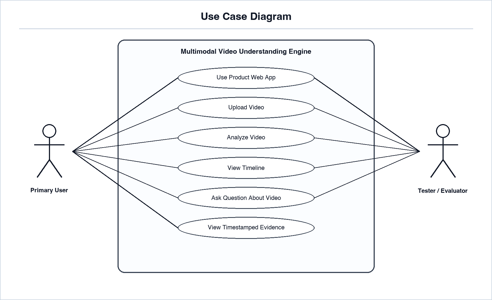

### B.3 Use Case Summary

| Use Case | Actor | Description | Related Requirements |
|---|---|---|---|
| Upload Video | Primary User, QA Tester | User uploads an mp4 or mov video file. | FR-1 to FR-6 |
| Analyze Video | Primary User, QA Tester | System extracts audio, transcript, keyframes, scenes, frame summaries, and timeline. | FR-7 to FR-21 |
| View Timeline | Primary User, QA Tester | User retrieves timestamped timeline events. | FR-18 to FR-20, FR-34 |
| Ask Question About Video | Primary User, QA Tester | User asks natural-language questions about a processed video. | FR-22 to FR-28 |
| View Timestamped Evidence | Primary User, QA Tester | System returns timestamps, frames, and timeline evidence with answers. | FR-20, FR-25 |
| Use Product Web App | Primary User, QA Tester | User completes upload, analyze, timeline, and ask from the local web app. | FR-36 to FR-45 |

### B.4 System Context Diagram

The context diagram defines what is inside the system boundary and what remains external. Each external connection is shown with both direction and meaning: user inputs enter the system as uploaded videos and questions, while system outputs return as status, timeline, answers, and timestamped evidence.

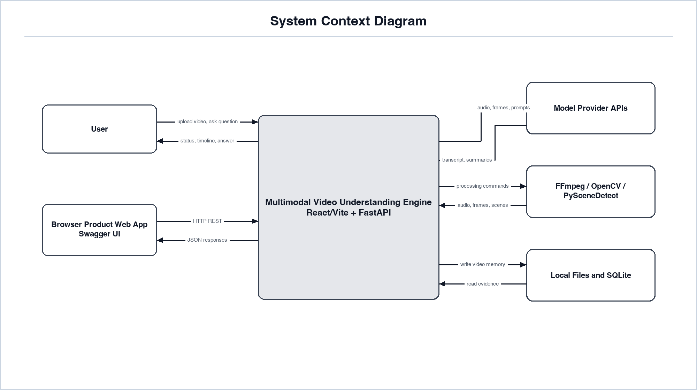

### B.5 Level-1 Data Flow Diagram

The data flow diagram shows how raw video becomes structured video memory.

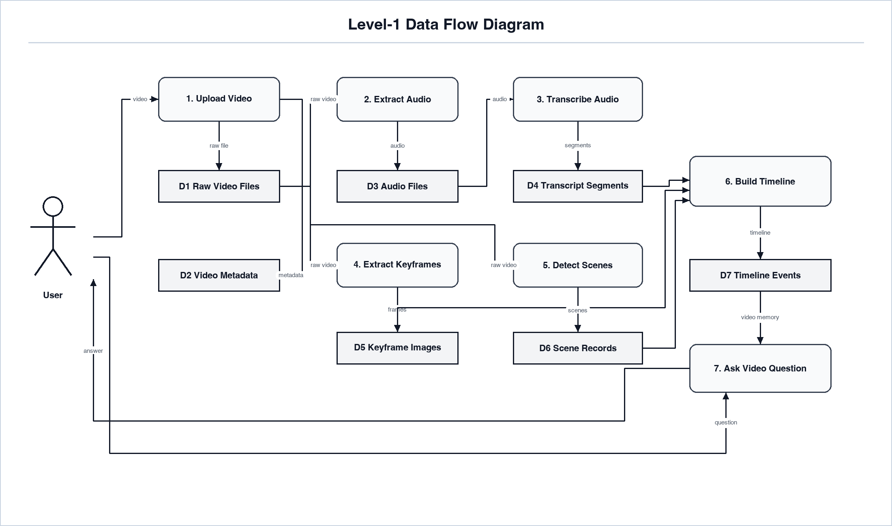

### B.6 Processing Pipeline Diagram

This diagram represents the technical pipeline that replaces the naive idea of watching every frame.

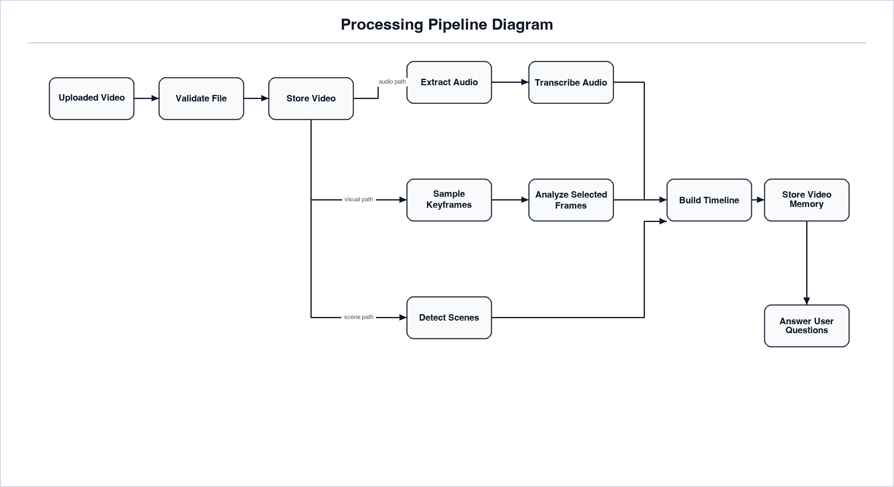

### B.7 Activity Diagram

The activity diagram describes the main user workflow and the important decision points.

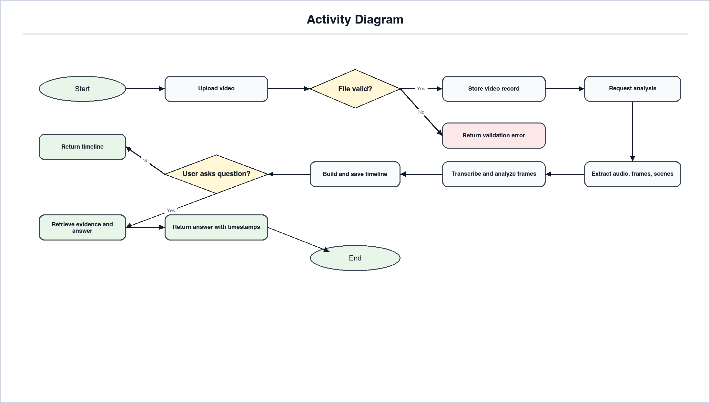

### B.8 Upload and Analysis Sequence Diagram

This sequence diagram shows the runtime behavior for uploading and analyzing a video.

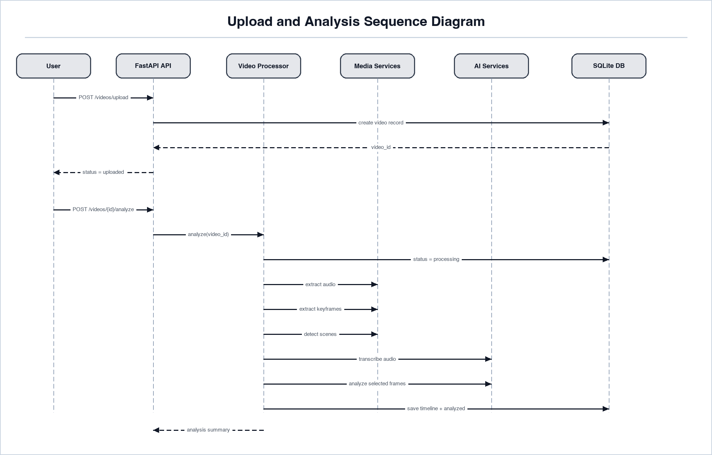

### B.9 Ask Video Sequence Diagram

This sequence diagram shows how the system answers a question without reprocessing the whole video.

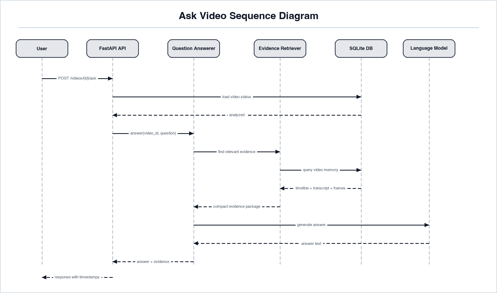

### B.10 Domain Class Diagram

The domain class diagram shows the main software objects the backend should model.

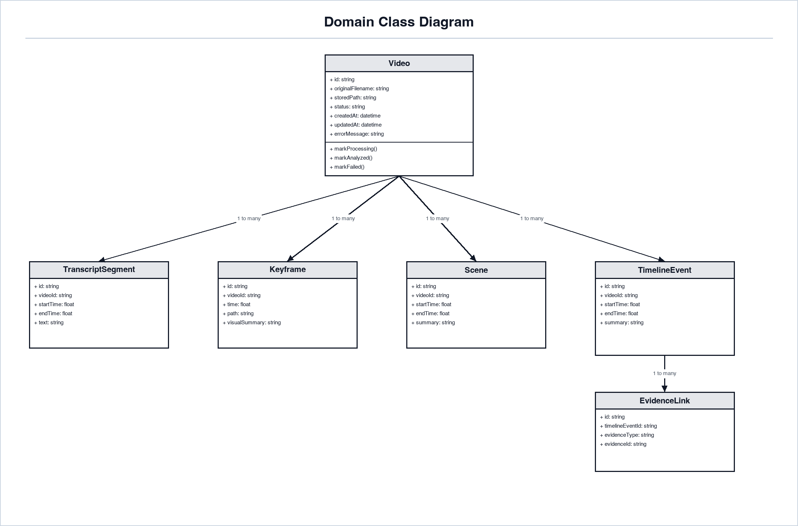

### B.11 Entity Relationship Diagram

The ERD defines the MVP storage model. SQLite is the first database target, but this model should remain compatible with PostgreSQL later.

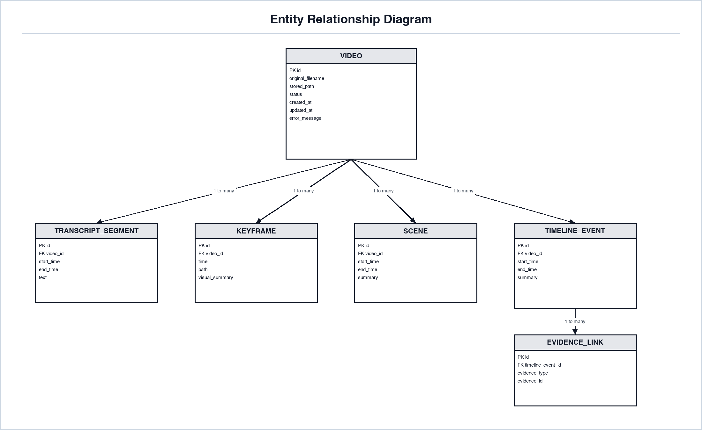

### B.12 Video Status State Diagram

The state diagram defines valid analysis states and prevents ambiguous behavior.

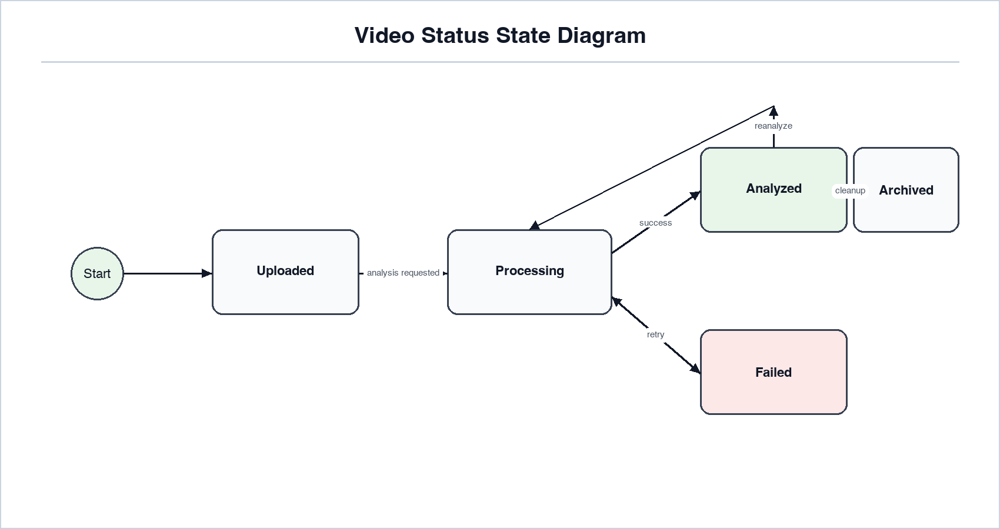

### B.13 Component Diagram

The component diagram shows the MVP backend modules as large owning components with their subcomponents inside them. It separates API ownership, application services, domain objects, infrastructure adapters, persistence, and external tools.

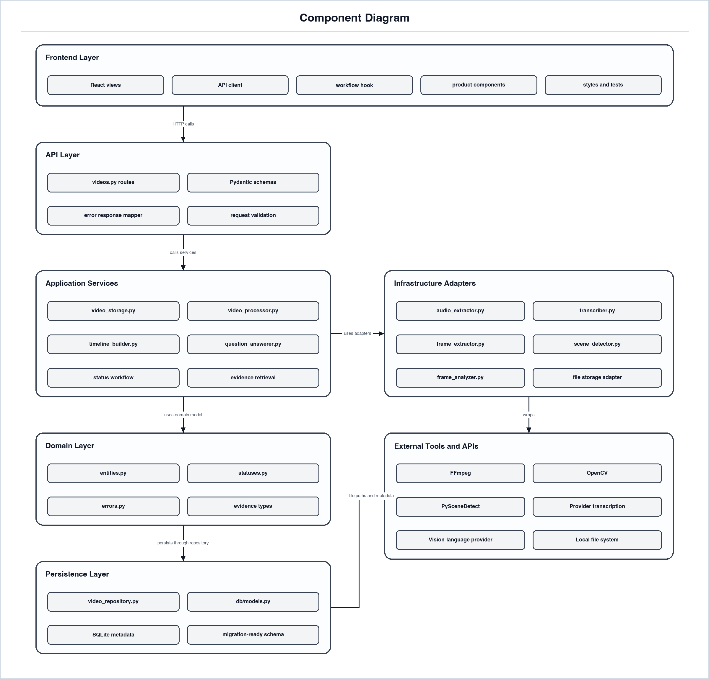

### B.14 Deployment Diagram

The deployment diagram shows the first local MVP environment. It separates the application runtime from local processing/storage and the external AI provider so deployment responsibilities remain clear.

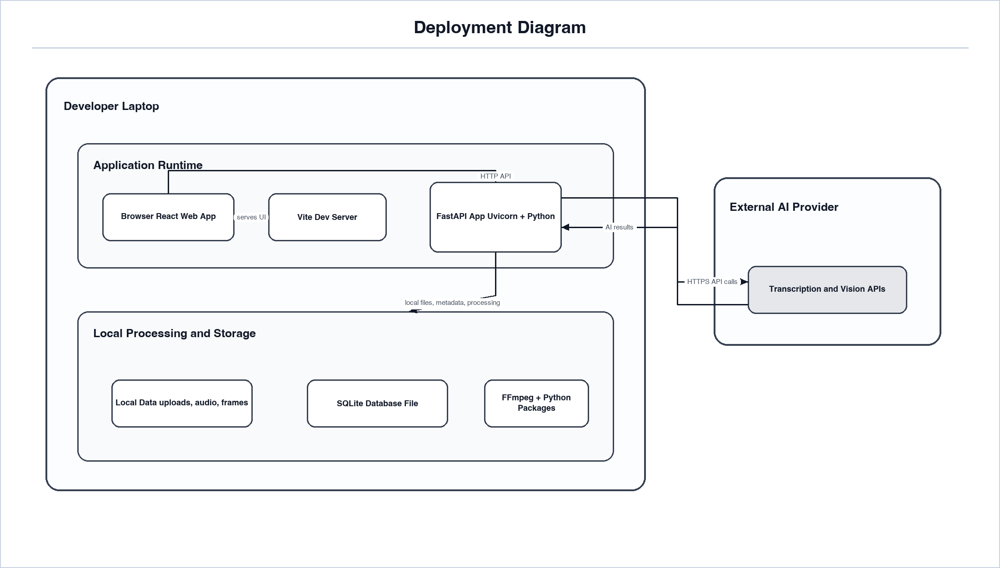

### B.15 API and Integration Swimlane Diagram

This swimlane diagram shows the API and integration flow across the user/client, FastAPI backend, processing services, external tools and provider APIs, and local storage. The diagram is arranged by vertical request columns so upload, analysis, timeline retrieval, and question answering can be followed without crossing arrows.

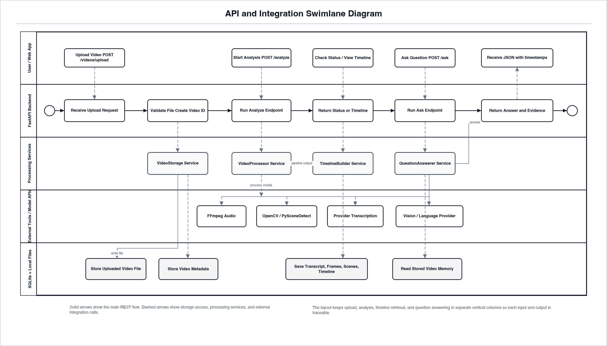

### B.16 Proposed Initial API Endpoints

| Endpoint | Method | Purpose |
|---|---|---|
| /videos/upload | POST | Upload a video and create a video record. |
| /videos/{video_id}/analyze | POST | Run preprocessing and timeline generation. |
| /videos/{video_id}/status | GET | Return current video processing status. |
| /videos/{video_id}/timeline | GET | Return the generated timeline. |
| /videos/{video_id}/ask | POST | Ask a question about the processed video. |

### B.17 Diagram-to-Requirement Traceability

| Requirement Area | Supporting Diagrams |
|---|---|
| Video upload | Use Case, Activity, Upload and Analysis Sequence, Component |
| Audio extraction | Data Flow, Processing Pipeline, Component |
| Transcription | Data Flow, Processing Pipeline, Upload and Analysis Sequence |
| Keyframe extraction | Data Flow, Processing Pipeline, Component |
| Scene detection | Data Flow, Processing Pipeline, Component |
| Visual analysis | Processing Pipeline, Component, Upload and Analysis Sequence |
| Timeline generation | Data Flow, Domain Class, ERD |
| Video question answering | Use Case, Ask Video Sequence, API and Integration Swimlane, Component |
| Storage and retrieval | ERD, Domain Class, Data Flow |
| Status and error behavior | Activity, Video Status State Diagram |

## Appendix C: To Be Determined List

| ID | Item |
|---|---|
| TBD-1 | Confirm exact external API models, versions, and documentation references before implementation. |
| TBD-2 | Review whether the 250 MB local MVP upload limit should change for any future hosted deployment. |
| TBD-3 | Resolved in M8: product web app foundation implemented with React/Vite for the local MVP. |
| TBD-4 | Confirm final database choice for the MVP: SQLite or PostgreSQL. |
| TBD-5 | Confirm expected video duration and resolution limits for product validation. |
| TBD-6 | Confirm final ownership and maintainer details for the specification cover page if required. |
